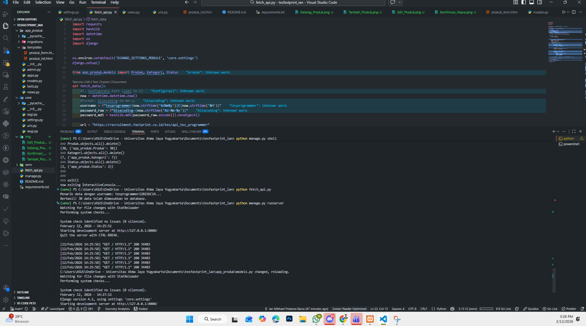
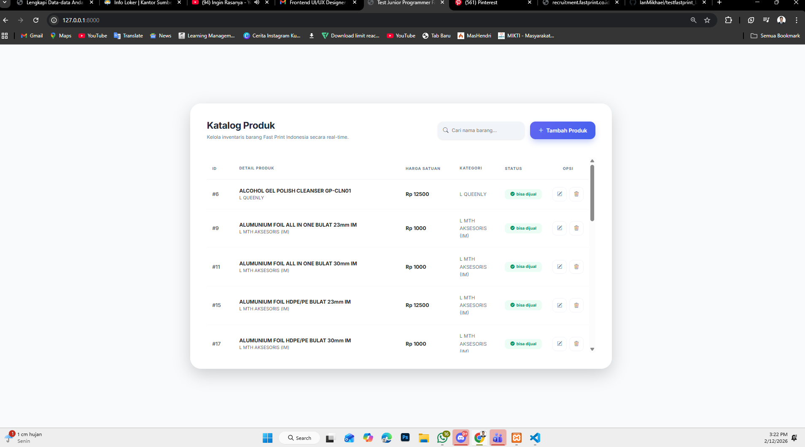
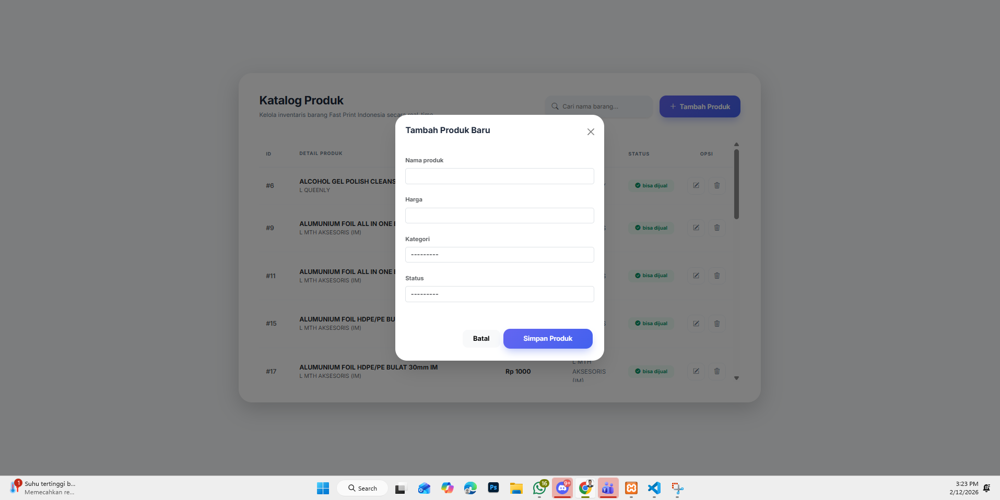
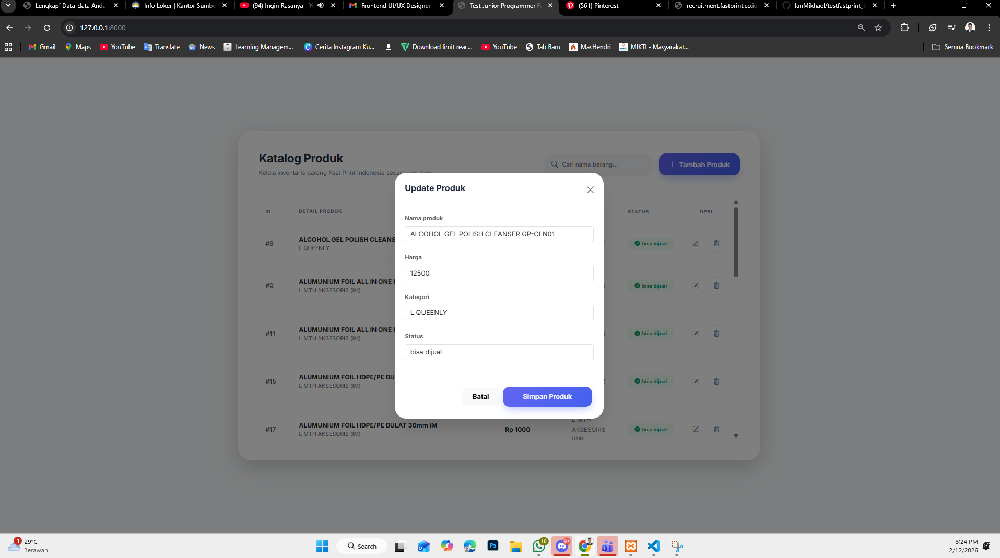
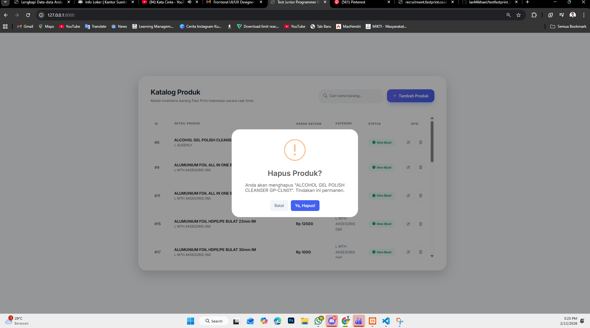

Hasil pengerjaan Tes Junior Programmer untuk Fast Print Indonesia.

## Fitur Utama
- Dynamic API Authentication: Mengimplementasikan sistem login API menggunakan username dinamis dan password enkripsi MD5 berdasarkan waktu server secara real-time.
- Automated Data Fetching: Script otomatis untuk menarik data dari API Fast Print dan mensinkronisasikannya ke database lokal.
- Executive Dashboard: Tampilan katalog produk yang bersih dengan fitur *Sticky Header* dan pencarian real-time.
- Filter "Bisa Dijual": Sistem secara otomatis hanya menampilkan produk yang memiliki status "bisa dijual" sesuai instruksi tes.
- Full CRUD & Validation: Fitur Tambah, Edit, dan Hapus data dengan validasi input (Nama wajib diisi, Harga wajib angka).
- Secure Deletion: Konfirmasi hapus data menggunakan library **SweetAlert2** untuk mencegah kesalahan penghapusan.

## Tech Stack
- Backend  : Django (Python 3.x)
- Database : MySQL / PostgreSQL
- Frontend : Bootstrap 5, SweetAlert2, Bootstrap Icons

## Cara Menjalankan Proyek

### 1. Persiapan Environment
## bash
# Masuk ke folder proyek
cd testfastprint_IanMikhael

# Buat dan aktifkan virtual environment
python -m venv venv
venv\Scripts\activate     # Untuk Windows

## 📸 Screenshot Tampilan

### 1. Bukti Sinkronisasi Data API

### 2. Dashboard Katalog Produk

### 3. Fitur Tambah & Edit Produk

### 4. Konfirmasi Hapus (SweetAlert2)

